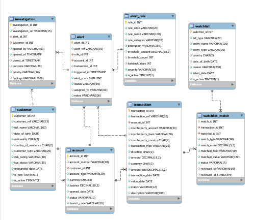

# Suspicious Activity Monitor (SAM)

Suspicious Activity Monitor is a team project built to detect potentially suspicious financial transactions.
The system screens transactions using configurable rules, checks customers against watchlists, creates alerts, and supports case investigation management.

---

## Contents

- [Sprint 1](#sprint-1)
- [Sprint 2](#sprint-2)
- [Project Structure](#project-structure)
- [Environment Setup](#environment-setup)
- [Running the Application](#running-the-application)
- [Running Tests](#running-tests)
- [JaCoCo Coverage Report](#jacoco-coverage-report)
- [API Examples](#api-examples)
- [E/R Diagram](#er-diagram)
- [Team](#team)

---

## Tech Stack

| Layer | Technology |
|---|---|
| Language | Java 21 |
| Framework | Spring Boot 3.5.13 |
| ORM | Spring Data JPA / Hibernate |
| Database (prod) | MySQL 8 |
| Database (test) | H2 in-memory |
| Build | Maven |
| Coverage | JaCoCo 0.8.11 |
| API Docs | Springdoc OpenAPI 2.8.16 |
| Utilities | Lombok, Spring Dotenv |

---

## Sprint 1

### Database Schema

Eight tables designed with proper constraints, indexes, check conditions, and foreign keys:

| Table | Purpose |
|---|---|
| `customer` | Customer profiles with KYC status, risk rating, and PEP flag |
| `account` | Bank accounts linked to customers (CURRENT, SAVINGS, TRADING, etc.) |
| `txn` | Financial transactions with USD-normalised amounts for rule evaluation |
| `alert_rule` | Configurable rules with thresholds, lookback windows, and severity |
| `alert` | Raised alerts linking a rule, account, and triggering transaction |
| `investigation` | Case management records linked to alerts |
| `watchlist` | Sanctions and PEP list entries (OFAC, UN, EU, HMT, INTERPOL, etc.) |
| `watchlist_match` | Match records linking transactions to watchlist hits with confidence scores |

### Views

Read-only access to the database is provided through two views:

- **`open_alerts_vw`** — joins alerts with transaction and customer detail for all open and under-review cases
- **`high_risk_accounts_vw`** — surfaces HIGH risk customers with alerts triggered in the last 30 days

### Stored Procedures

All write operations go through stored procedures — no direct SQL from the application:

- **`raise_alert`** — creates a new alert record with a severity-based risk score (CRITICAL → 95, HIGH → 75, MEDIUM → 55, LOW → 35)
- **`screen_transaction`** — iterates active alert rules, calls `raise_alert` for each match, then marks the transaction as SCREENED
- **`match_watchlist`** — fuzzy-matches entity names against watchlist entries (exact = 100, partial = 85) above a configurable threshold

### Shell Scripts

| Script | Purpose |
|---|---|
| `db_create.sh` | Drops and recreates the database, loads tables, seed data, procedures, and views in dependency order |
| `db_dump.sh` | Creates a timestamped MySQL dump including routines and triggers |
| `db_reload.sh` | Restores the database from a dump file |
| `rebuild_indexes.sh` | Runs `OPTIMIZE` and `ANALYZE` on tables for DBA maintenance |
| `open_cases_report.sh` | Exports open, under-review, and escalated alerts to CSV |

---

## Sprint 2

### Domain Model & Persistence
- Full JPA entity model mapped to the Sprint 1 schema
- Spring Data JPA repositories for all eight entities
- H2 in-memory database wired for the `test` profile — no MySQL required to run tests

### Rules Engine

Six AML rules implemented, each behind the `AmlRule` interface and independently testable:

| Rule | Category | What it detects |
|---|---|---|
| `ThresholdRule` | STRUCTURING | Single transaction exceeding a configured USD limit |
| `VelocityRule` | VELOCITY | Too many transactions within a rolling lookback window |
| `StructuringRule` | STRUCTURING | Cumulative amounts approaching (75–100%) the reporting threshold |
| `RoundNumberRule` | PATTERN | Suspiciously round amounts (multiples of 1 000 USD) |
| `PatternRule` | PATTERN | Same amount repeated ≥ N times — smurfing detection |
| `GeographyRule` | GEOGRAPHY | Transactions involving high-risk/sanctioned jurisdictions |

### Services

- **`RuleEngineService`** — loads all active `AlertRule` records, builds a `RuleContext` per transaction, runs every applicable rule, and calls the `raise_alert` stored procedure for each match
- **`WatchlistScreeningService`** — normalises customer names, scores against all active watchlist entries, persists `WatchlistMatch` records, and updates transaction status (BLOCKED / PENDING / SCREENED)

### DAO Layer

Five DAO classes wrapping repository logic with domain-specific query methods: `AlertDao`, `AlertRuleDao`, `TxnDao`, `WatchlistDao`, `WatchlistMatchDao`

### Test Suite

| Layer | Test classes |
|---|---|
| Unit — Rules | `ThresholdRuleTest`, `VelocityRuleTest`, `RoundNumberRuleTest`, `StructuringRuleTest`, `PatternRuleTest`, `GeographyRuleTest` |
| Unit — Services | `RuleEngineServiceTest`, `AlertRaisingServiceTest` |
| Unit — DAOs | `AlertRuleDaoTest`, `TxnDaoTest` |
| Integration | `CustomerAccountTxnFlowIT`, `InvestigationFlowIT`, `WatchlistMatchFlowIT` |
| Context | `SamApplicationTests` |

---

## Project Structure

```
sam/
├── src/main/java/com/grad/sam/
│   ├── dao/              # DAO wrappers (AlertDao, TxnDao, …)
│   ├── enums/            # AlertSeverity, AlertStatus, RuleCategory, …
│   ├── exception/
│   ├── model/            # JPA entities
│   ├── repository/       # Spring Data JPA interfaces
│   ├── rules/            # AmlRule interface + 6 rule implementations
│   └── service/          # RuleEngineService, WatchlistScreeningService
├── src/main/resources/
│   └── application.properties
├── src/test/java/com/grad/sam/
│   ├── dao/
│   ├── integration/
│   ├── rules/
│   └── service/
├── src/test/resources/
│   └── application-test.properties   # H2 config, activated by @ActiveProfiles("test")
├── schema/
│   ├── tables/                       # One .sql file per table
│   ├── views/                        # One .sql file per view
│   ├── stored_procedures/            # One .sql file per procedure
│   └── diagram.png                   # E/R diagram
├── scripts/                          # Shell scripts for db automation
└── .env                              # Local credentials — never commit this file
```

---

## Environment Setup

The project uses [spring-dotenv](https://github.com/paulschwarz/spring-dotenv) to load credentials from a `.env` file at the project root. This keeps secrets out of `application.properties` and out of version control.

Create a file named `.env` in the project root (same level as `pom.xml`):

```env
DB_HOST=localhost
DB_PORT=3306
DB_NAME=sam
DB_USER=root
DB_PASSWORD=your_password_here
```

> `.env` is in `.gitignore` — never commit it. Each team member keeps their own local copy.

These values are injected into `application.properties` at startup:

```properties
spring.datasource.url=jdbc:mysql://${DB_HOST}:${DB_PORT}/${DB_NAME}?useSSL=false&serverTimezone=UTC&allowPublicKeyRetrieval=true
spring.datasource.username=${DB_USER}
spring.datasource.password=${DB_PASSWORD}
```

If a variable is absent from `.env`, the defaults in `application.properties` kick in: `localhost`, `3306`, `sam`, `root`.

---

## Running the Application

```bash
# Make sure MySQL is running and the sam database exists
# Make sure your .env file is configured (see above)

mvn spring-boot:run
```

The app starts on `http://localhost:8080`.
Swagger UI is available at `http://localhost:8080/swagger-ui.html`.

---

## Running Tests

Tests use an H2 in-memory database. **No MySQL or `.env` file required.**

```bash
# Run all tests
mvn test

# Run a specific test class
mvn test -Dtest=ThresholdRuleTest

# Run all rule unit tests
mvn test -Dtest="*RuleTest"

# Run integration tests only
mvn test -Dtest="*FlowIT"
```

Test results are written to `target/surefire-reports/`.

---

## JaCoCo Coverage Report

JaCoCo generates a coverage report automatically after every `mvn test` run. No extra command needed.

```bash
# 1. Run tests (report is generated automatically)
mvn test

# 2. Open the report

# macOS
open target/site/jacoco/index.html

# Windows
start target/site/jacoco/index.html

# Linux
xdg-open target/site/jacoco/index.html
```

The report is at `target/site/jacoco/index.html`. Enum classes under `com.grad.sam.enums` are excluded from coverage metrics by configuration.

---

## API Examples

- `POST /api/transactions/screen`
- `GET /api/alerts`
- `GET /api/alerts/{id}`
- `PATCH /api/alerts/{id}/status`
- `POST /api/cases`
- `GET /api/cases/{id}`
- `POST /api/cases/{id}/notes`
- `GET /api/watchlist/search?name={name}`

---

## E/R Diagram



---

## Team

- Teammate 1 – Zofia Grabowska
- Teammate 2 – Rumbidzai Jinjika
- Teammate 3 – Patrycja Kościelniak
- Teammate 4 – Marta Kozdrój
