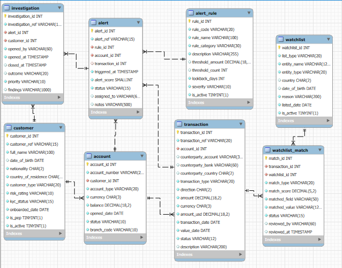

# Suspicious Activity Monitor

Suspicious Activity Monitor is a team project built to detect potentially suspicious financial transactions.  
The system screens transactions using configurable rules, checks customers against watchlists, creates alerts, and supports case investigation management.

## Tech Stack

- Java
- Spring Boot
- SQL
- Docker
- GitHub

## Main Features

- Screen transactions against active alert rules
- Detect suspicious patterns such as:
    - threshold breaches
    - velocity activity
    - round-number transactions
- Match customers against watchlists
- Create and manage alerts
- Open and update investigation cases

## Project Structure

- `model` – domain entities
- `repository` – database access
- `service` – business logic
- `rules` – alert rule implementations
- `scripts/db` – database scripts

## How to Run

1. Clone the repository
2. Build the project with Maven
3. Run the application
4. Start Docker if needed
5. Access the API on port `8080`

## API Examples

- `POST /api/transactions/screen`
- `GET /api/alerts`
- `GET /api/alerts/{id}`
- `PATCH /api/alerts/{id}/status`
- `POST /api/cases`
- `GET /api/cases/{id}`
- `POST /api/cases/{id}/notes`
- `GET /api/watchlist/search?name={name}`

## Database

The project includes core entities such as:

- Customer
- Account
- Transaction
- Watchlist
- WatchlistMatch
- AlertRule
- Alert
- Investigation

## E/R Diagram

## Team

- Teammate 1 – [Zofia Grabowska]
- Teammate 2 – [Rumbidzai Jinjika]
- Teammate 3 – [Patrycja Kościelniak]
- Teammate 4 – [Marta Kozdrój]
